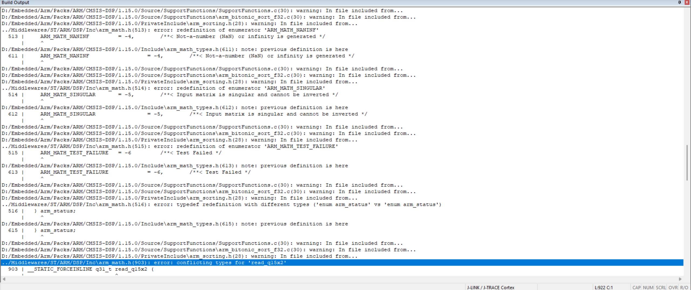

## 一 booster.h和booster.cpp的更改
#### 1.
##### 遇到的问题:
###### 打开培训仓库的 Keil 工程后，编译报大量 redefinition of enumerator 'ARM_MATH_SUCCESS' 等枚举重定义错误。
##### 解决办法：头文件冲突：工程中同时存在两个不同来源的 CMSIS-DSP 库头文件：
##### 工程自带：./Middlewares/ST/ARM/DSP/Inc

##### Keil Pack 安装的全局路径：D:/Embedded/ARM/Packs/ARM/CMSIS-DSP/...

##### 两者定义了相同的枚举，导致重复定义。
###### 尝试在 RTE（Run-Time Environment）中取消勾选 CMSIS → DSP 组件，重定义错误减少，但出现新的链接错误：undefined reference to arm_mat_init_f32、arm_cos_f32 等 DSP 数学函数。
##### 缺少库实现：取消勾选 DSP 后，Keil 不再链接 DSP 库的 .lib 文件，但工程代码（如 tsk_config_and_callback.c、kalman_filter.c）实际调用了 DSP 函数，因此链接失败。

#### 🥸How解决？
##### 保留 RTE 中的 DSP 组件（重新勾选 CMSIS → DSP），确保库实现被正确链接。

##### 删除工程自带的重复 DSP 头文件路径：在 Options for Target → C/C++ → Include Paths 中移除 ./Middlewares/ST/ARM/DSP/Inc
#### 2.主要是在djimotor.h加了个inline 关于rpm的；深化了卡弹策略；在config里面加了单级摩擦轮和双极摩擦轮。