# 一、首先，该头文件的一开始有很多的 *宏定义* 来替代魔法数字。
### 现在理清这些宏定义的意思：
###### 🤣第一组（感觉暂时无关紧要）
```c
#define PI 3.14159265358979323846f
#define DMA_FLAG_TCIF4 ((uint32_t)0x20000020)
```
##### #define PI 3.14159265358979323846f：圆周率 π，用于角度与弧度的转换，例如在 CarPosture_Change 中将弧度转换为角度显示。
##### #define DMA_FLAG_TCIF4 ((uint32_t)0x20000020)：DMA 传输完成标志位（Transfer Complete Interrupt Flag），通常用于检查 DMA 发送是否结束。在当前 UI 模块中未直接使用???.


##  🤣第二组(理解下直观的比例坐标)
```c
#define SCREEN_WIDTH 1080
#define SCREEN_LENGTH 1920 
```
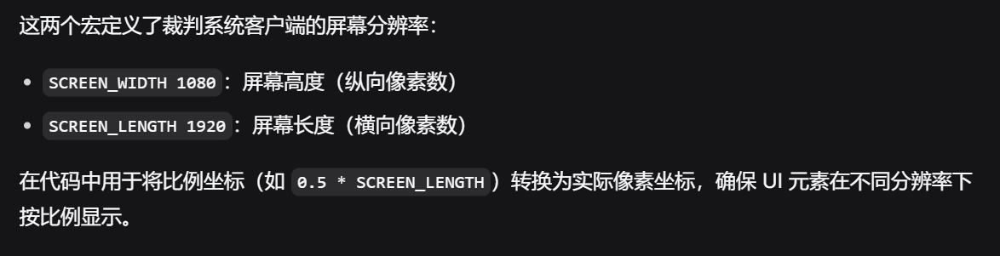
#### emmmm?😢比例坐标（如 0.5 * SCREEN_LENGTH）转换为实际像素坐标，啥意思？
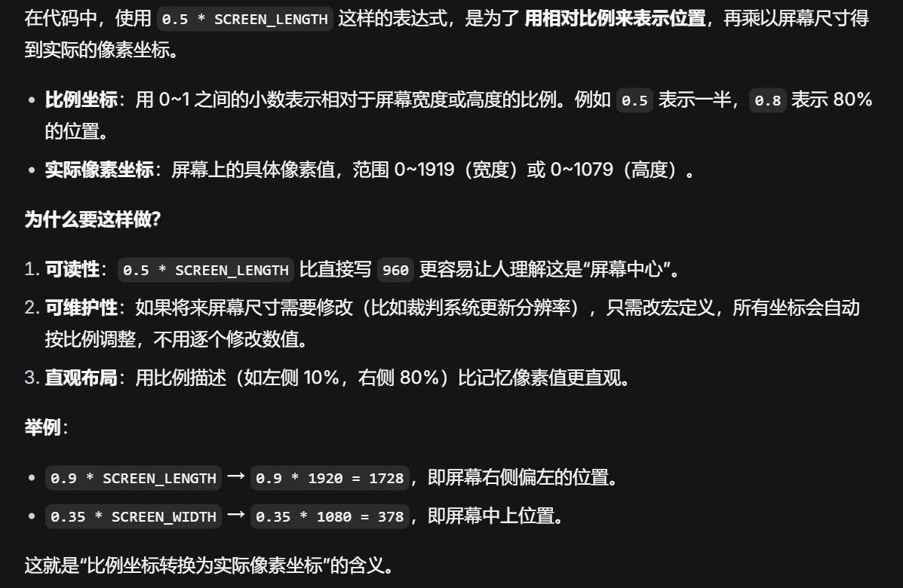
##  🤣第三组（）
```c
#define SEND_MAX_SIZE 128 
#define HEADER_LEN 5	 
#define CMD_LEN 2
#define CRC_LEN 2
#define DRAWING_PACK 15
```
###### 这些宏用于裁判系统通信协议的帧封装，定义数据包各个部分的长度：

 ##### SEND_MAX_SIZE：发送缓冲区最大长度（128字节），防止数组越界。

##### HEADER_LEN：帧头长度（5字节），包含同步头 0xA5、数据长度（2字节）、序列号（1字节）、帧头CRC8（1字节）。

##### CMD_LEN：命令ID长度（2字节），用于标识数据包类型（如绘制图形、删除图形等）。

##### CRC_LEN：尾部CRC16校验长度（2字节），保证数据完整性。

##### DRAWING_PACK：单个图形数据结构体（graphic_data_struct_t）的字节大小（15字节），用于计算图形数据段长度。

###### 在 Send_toReferee 函数中，会利用这些宏计算总帧长：
```c
Frame_Length = HEADER_LEN + CMD_LEN + CRC_LEN + data_len;
```

##  🤣第四组（命令ID）
```c
#define Drawing_Delete_ID 0x0100
#define Drawing_Graphic1_ID 0x0101
#define Drawing_Graphic2_ID 0x0102
#define Drawing_Graphic5_ID 0x0103
#define Drawing_Graphic7_ID 0x0104
#define Drawing_Char_ID 0x0110
```
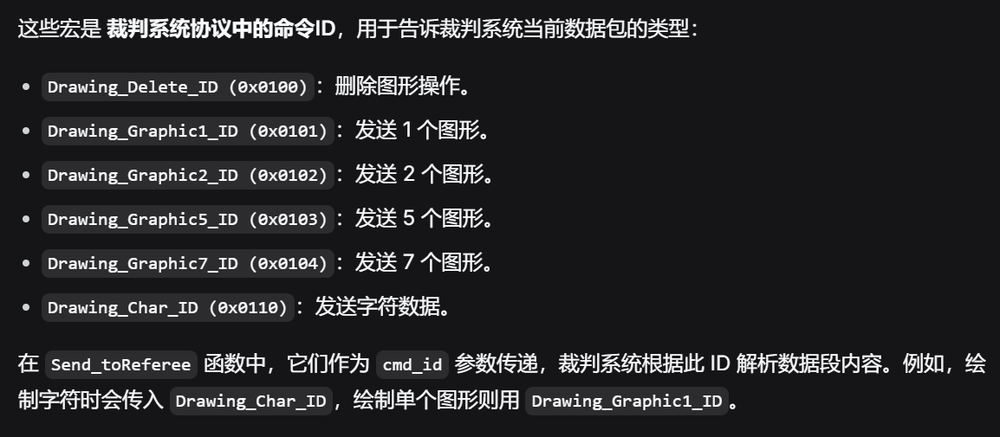
###### 如何被使用？比如，void Send_toReferee(uint16_t cmd_id, uint16_t data_len);
```c
 Send_toReferee(0x0301, pack_len + header_len); // 发送整个数据帧数据.
 ```
 .png)
###### 比如
```c
Send_UIPack(Drawing_Char_ID, JudgeReceiveData.robot_id, JudgeReceiveData.robot_id + 0x100, data_pack, DRAWING_PACK + 30); // 发送字符
```
### 😢是不是有一点疑惑？为什么一会儿是0x0301，一会儿是Drawing_Char_ID这样子的。
###### 其实只是对协议结构具体内容还不够了解。这两个数字处于协议的不同层次，具有不同的作用。见下图：
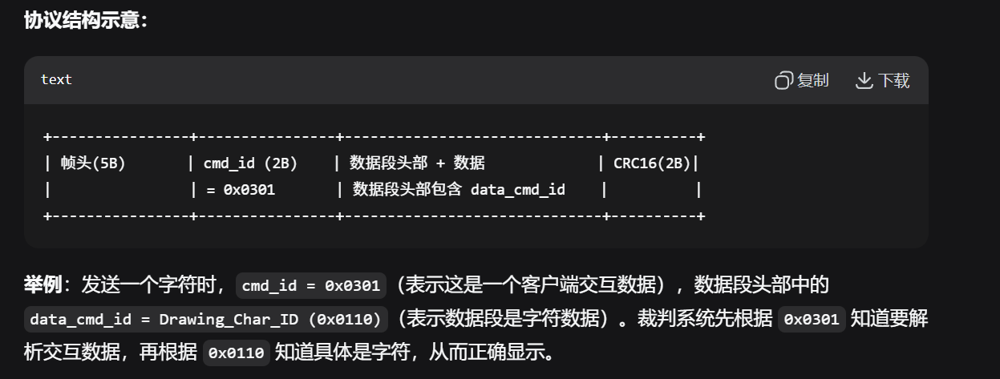

##  🤣第五组（操作类型）
```c
#define Op_None 0
#define Op_Add 1
#define Op_Change 2
#define Op_Delete 3
#define Op_Init 1 
```
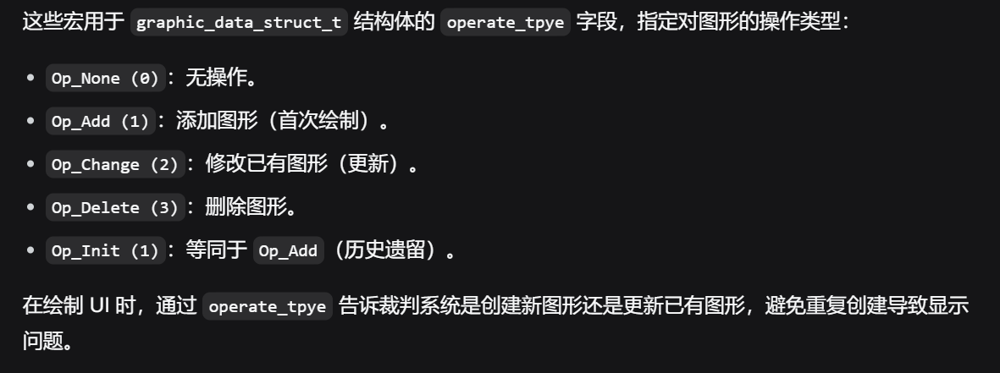
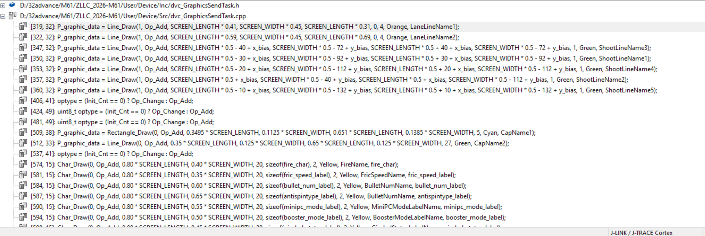
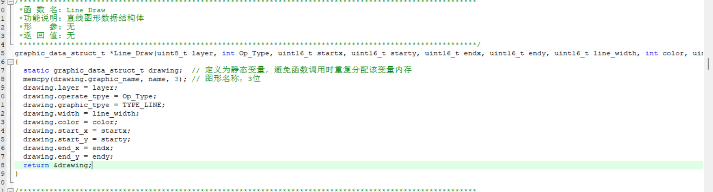
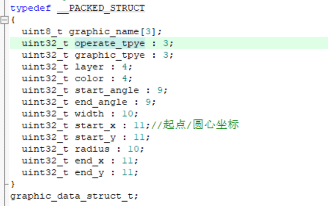
**第四组vs第五组** 
###### 命令ID宏：告诉裁判系统 数据包的类型（图形/字符及数量）。
###### 操作类型宏：告诉裁判系统 对图形的具体操作（添加、修改、删除）。
##  🤣第六组（删除类型）
```c
#define CLEAR_ONE_LAYER 1U
#define CLEAR_ALL 2U
```
### 这两个宏用于 图形删除 操作：
##### CLEAR_ONE_LAYER：清除指定图层（layer）上的所有图形。

##### CLEAR_ALL：清除所有图层上的所有图形。
##### 在 Deleta_Layer 函数中作为 deleteType 参数传入，控制删除范围。
### UI界面是分层的.
### 在裁判系统 UI 中，图层（layer） 是一个重要的概念，类似于 Photoshop 的图层。每个图形都归属于一个图层（0~9），图层的编号决定了图形的显示顺序：数字越小越靠近底层，数字越大越靠近顶层，即上层会覆盖下层。
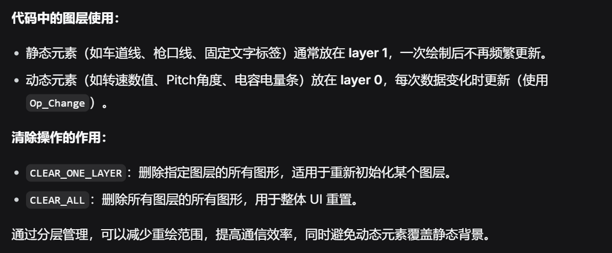
##  🤣第七组（颜色）
```c
#define Red_Blue 0
#define Yellow 1
#define Green 2
#define Orange 3
#define Purple 4
#define Pink 5
#define Cyan 6
#define Black 7
#define White 8
```
###### 这些颜色宏定义了裁判系统支持的 9 种颜色（0~8），用于图形绘制时的 color 字段。它们将数字映射为有意义的名称，提高代码可读性，确保与协议严格对应。例如 Green 表示 2，裁判系统客户端会显示为绿色。

##  🤣第八组（宏定义底盘的6种工作模式）
```c
#define Chassis_Powerdown_Mode 0
#define Chassis_Act_Mode 1
#define Chassis_SelfProtect_Mode 2
#define Chassis_Solo_Mode 3
#define Chassis_Jump_Mode 4
#define Chassis_Test_Mode 5
```
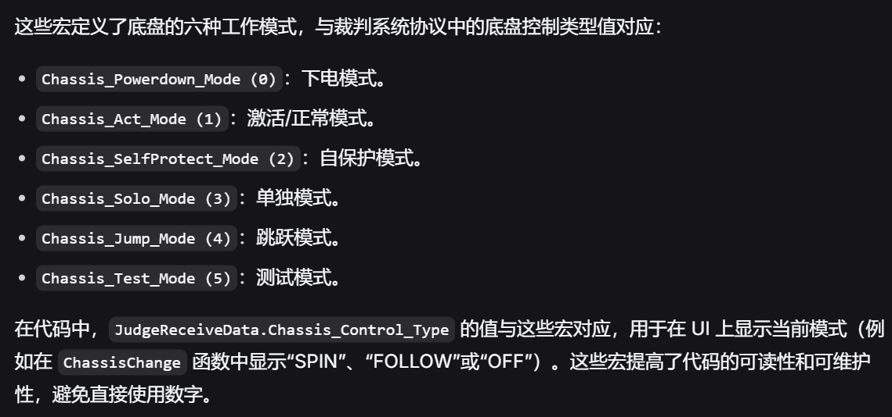
##  🤣第九组（宏定义云台的工作模式）
```c
#define Gimbal_Powerdown_Mode 7
#define Gimbal_Act_Mode 3
#define Gimbal_Armor_Mode 0
#define Gimbal_BigBuf_Mode 2
#define Gimbal_DropShot_Mode 4
#define Gimbal_SI_Mode 5
#define Gimbal_Jump_Mode 6
#define Gimbal_AntiSP_Mode 7
#define Gimbal_SmlBuf_Mode 1
```
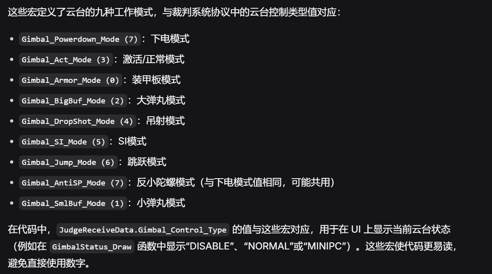

# 二、接着，封装。
### 1.    F405_typedef
###### F405_typedef 是一个用于存储机器人控制状态和用户配置的结构体，通常用于与主控芯片（如 STM32F405）相关的控制逻辑。虽然它在当前 UI 模块中没有被直接使用，但在整个机器人工程中，它是连接用户指令与底层执行的关键数据结构。
```c
typedef struct
{
	char SuperPowerLimit;	// 0Ϊ�������ݹرգ���Ϊ0����ʹ�ó�������
	char Chassis_Flag;		// ģʽ����
	char AutoFire_Flag;		// 0��ʾ�ֶ�����1Ϊ�Զ�����
	char Laser_Flag;		// 0��ʾ����رգ�1Ϊ��
	short Pitch_100;		// pitch�Ƕ�,����100֮��
	short Yaw_100;			// yaw�Ƕ�,����100֮��
	char Gimbal_Flag;		// ģʽ����
	char Graphic_Init_Flag; // 0Ϊ�����ʼ��ģʽ��1Ϊ��ʼ������
	char Freq_state;		// ��Ƶ״̬��0��ʾ������Ƶ��1��ʾ����Ƶ
	char Enemy_ID;
	/*�������*/
	char Send_Pack1;
	char Fric_Flag;
} F405_typedef;
```
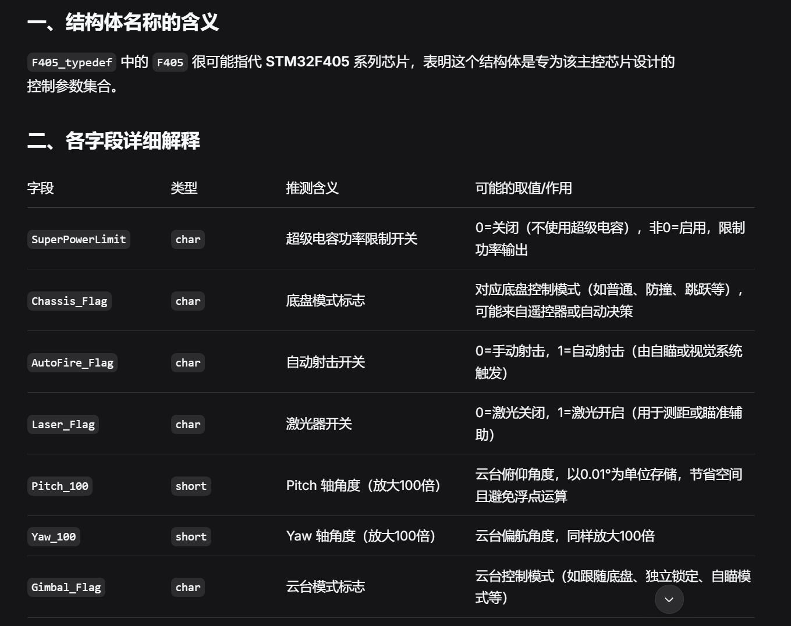
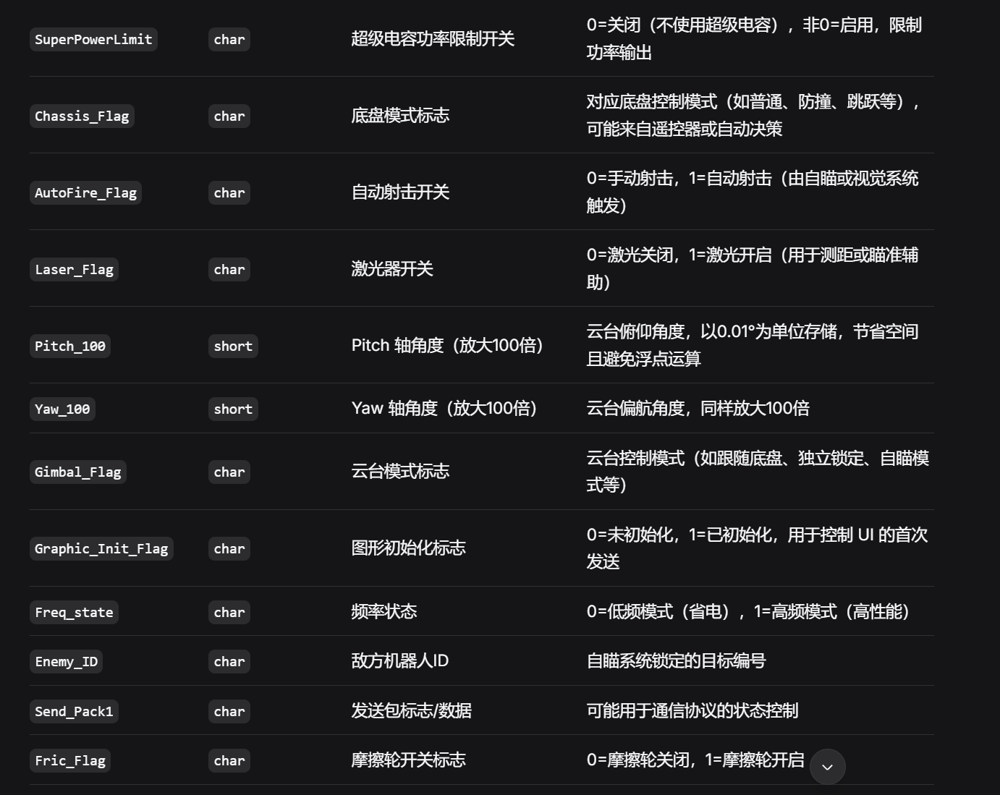
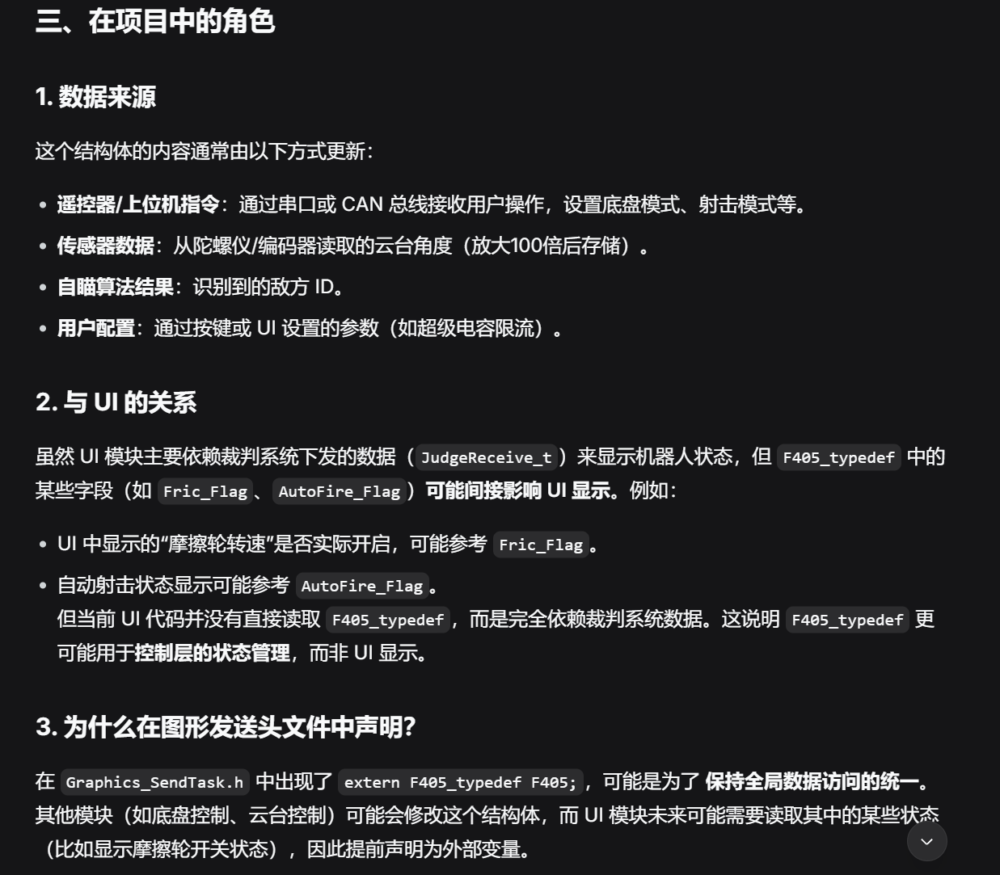

### 2. 
```c
enum ARMOR_ID
{
	ARMOR_AIM_LOST = 0,
	ARMOR_ID_1,
	ARMOR_ID_2,
	ARMOR_ID_3,
	ARMOR_ID_4,
	ARMOR_ID_5,
	ARMOR_ID_Sentry,
};
```
#### enum ARMOR_ID 是用于自瞄系统中标识装甲板编号的枚举类型，主要服务于视觉识别和自动瞄准功能。
#### 作用场景：当视觉系统（MiniPC）识别到敌方机器人的装甲板时，会返回装甲板的编号（如 1~5 对应不同的装甲板位置，或不同机器人的 ID）。云台根据该编号决定瞄准点（例如优先打击某个装甲板），同时可能将编号上报给裁判系统用于 UI 显示（如显示当前锁定的目标）。该枚举使代码可读性更强，避免直接使用数字。
### 3.
```c
typedef __PACKED_STRUCT
{
	uint8_t graphic_name[3];
	uint32_t operate_tpye : 3;
	uint32_t graphic_tpye : 3;
	uint32_t layer : 4;
	uint32_t color : 4;
	uint32_t start_angle : 9;
	uint32_t end_angle : 9;
	uint32_t width : 10;
	uint32_t start_x : 11;//起点/圆心坐标
	uint32_t start_y : 11;
	uint32_t radius : 10;
	uint32_t end_x : 11;
	uint32_t end_y : 11;
}
graphic_data_struct_t;
```


//未完待续