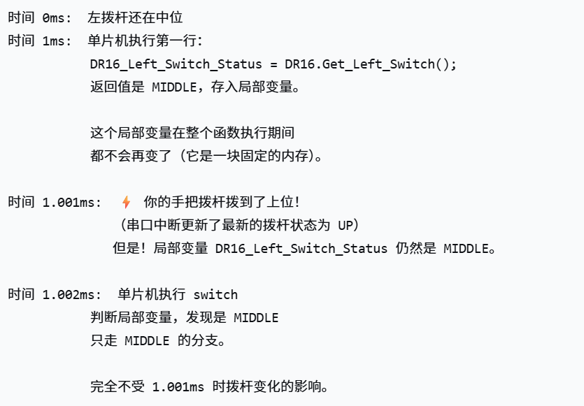

## 1.把值存到局部变量：防抖和逻辑互斥😮
#### 在函数入口处一次性"拍照"，把拨杆状态冻结到局部变量里。
#### 然后整个函数只看这张照片，不管后面真实拨杆怎么变，本次执行的逻辑始终基于同一时刻的状态。
###### 假设现在遥控器左拨杆在中位，然后你把它拨到了上位。这个物理动作再快，也需要时间，比如花了 20毫秒。但你的代码跑一遍 Control_Booster() 只需要 1毫秒。所以在你拨动拨杆的这 20 毫秒里，单片机已经把 Control_Booster() 执行了 20 遍。
##### 假设没有存到局部变量里，而是直接调用两次
###### 如果代码这么写
```c
// ❌ 不存变量，直接调两次
if (DR16.Get_Left_Switch() == DR16_Switch_Status_MIDDLE) {
    // A 功能
}

// 其他代码...

if (DR16.Get_Left_Switch() == DR16_Switch_Status_UP) {
    // B 功能
}
```
##### 时间轴模拟
###### 时间 0ms:  左拨杆还在中位
###### 时间 1ms:  单片机执行到第一个 if 判断
###### DR16.Get_Left_Switch() 返回 MIDDLE ✅
###### 准备进入 A 功能...
###### 时间 1.001ms:  ⚡ 就在这个瞬间，你的手把拨杆拨到了上位！
###### （串口中断更新了最新的拨杆状态为 UP）
###### 时间 1.002ms:  单片机执行到第二个 if 判断
###### DR16.Get_Left_Switch() 返回 UP ✅
###### 也进入 B 功能...
##### 同一次 Control_Booster() 执行中，既走了 A 功能，又走了 B 功能。
##### 这在一个 switch 里更危险——本来是互斥的逻辑，结果因为状态在中途变了，两个 case 的条件都满足了，逻辑全乱。
#### ✅ 先存到局部变量，且用 volatile 确保一定读取
```c
volatile int DR16_Left_Switch_Status = DR16.Get_Left_Switch();

switch (DR16_Left_Switch_Status) {
    case DR16_Switch_Status_MIDDLE: ... break;
    case DR16_Switch_Status_UP:     ... break;
}
```

### “拍照”思路是嵌入式实时控制里非常经典且巧妙的设计模式
```c
void Class_Chariot::Control_Booster()
{
    static uint8_t booster_sign = 0;
    // 先判断当前活动的控制器
    Judge_Active_Controller();
    /************************************遥控器控制逻辑*********************************************/
    if (Active_Controller == Controller_DR16 && DR16_Control_Type == DR16_Control_Type_REMOTE)
    {
        volatile int DR16_Left_Switch_Status = DR16.Get_Left_Switch();
        volatile int DR16_Right_Switch_Status = DR16.Get_Right_Switch();
        switch (DR16_Right_Switch_Status)
        {
        case (DR16_Switch_Status_UP): // 右上 开启摩擦轮和发射机构
        {
            Booster.Set_Booster_Control_Type(Booster_Control_Type_CEASEFIRE);
            Booster.Set_Friction_Control_Type(Friction_Control_Type_ENABLE);
            if (DR16_Left_Switch_Status == DR16_Switch_Status_DOWN) // 左下
            {
```
###### volatile 在这里的作用是：强制编译器每次都真正调用函数并读取返回值，而不是用上一次缓存的结果。

## 2.无需裁判系统的热量控制计算FSM_Heat_Detect.Reload_TIM_Status_PeriodElapsedCallback();
##### 这个状态机通过监测摩擦轮扭矩尖峰来判断“弹丸已射出”，用100ms 时间滤波排除瞬时干扰，用摩擦轮启停状态过滤排除启停误触发，最终独立完成本地热量累加和冷却。
```c

void Class_FSM_Heat_Detect::Reload_TIM_Status_PeriodElapsedCallback()
{
    Status[Now_Status_Serial].Time++;

    static Enum_Friction_Control_Type Last_Friction_Control_Type = Friction_Control_Type_DISABLE;
    // 自己接着编写状态转移函数
    switch (Now_Status_Serial)
    {
    case (0):
    {
        // 正常状态

        if ((abs(Booster->Fric[0].Get_Now_Torque()) >= Booster->Friction_Torque_Threshold) && (abs(Booster->Fric[0].Get_Now_Torque()) < 10000.0f))
        {
            // 大扭矩->检测状态
            Set_Status(1);
        }
        else if (Booster->Booster_Control_Type == Booster_Control_Type_DISABLE)
        {
            // 停机->停机状态
            Set_Status(3);
        }
    }
    break;
    case (1):
    {
        // 发射嫌疑状态

        if (Status[Now_Status_Serial].Time >= test_period)
        {
            // 长时间大扭矩->确认是发射了
            Set_Status(2);
        }
    }
    break;
    case (2):
    {
        if (Last_Friction_Control_Type == Friction_Control_Type_DISABLE && Booster->Friction_Control_Type == Friction_Control_Type_ENABLE)
        {
            Set_Status(0);
        }
        else if (Last_Friction_Control_Type == Friction_Control_Type_ENABLE && Booster->Friction_Control_Type == Friction_Control_Type_DISABLE)
        {
            Set_Status(0);
        }
        else
        {
            // 发射完成状态->加上热量进入下一轮检测
            Booster->actual_bullet_num++;
            Heat += 100.0f;
            Set_Status(0);
        }
        Last_Friction_Control_Type = Booster->Get_Friction_Control_Type();
    }
    break;
    case (3):
    {
        // 停机状态

        if (abs(Booster->Fric[0].Get_Now_Omega_Radian()) >= Booster->Friction_Omega_Threshold)
        {
            // 开机了->正常状态
            Set_Status(0);
        }
    }
    break;
    }

    // 热量冷却到0
    if (Heat > 0)
    {
        Heat -= Booster->Cooling_Value / 1000.0f;
    }
    else
    {
        Heat = 0;
    }
}
```
### 如果一不小心产生了尖峰时间不到100ms（比如碰撞），但实际没有发射出子弹，但一直在进1ms的定时器中断，所以时间还是会慢慢累计达到100ms，这样子如果实际上摩擦轮发射一直处于开着的状态，那么也会误判发射了一发。
###### 应该是宁可误判，绝不漏判。本地热量只是备份：Cmd_if_Fire 用的是本地热量，但裁判系统的热量才是最终依据。如果本地热量虚高，操作手可以看裁判系统的 UI 判断真实热量。状态2 过滤了启停：最大的误触发源（摩擦轮启停）已经被状态2精确过滤。比赛中很少发生：弹丸磕碰枪管后弹开，或者外部撞击摩擦轮，在实际比赛中的概率很低。

## 3.卡弹状态机
#### 检测到拨弹盘转不动了，就自动执行一套恢复流程，从轻到重逐级尝试，实在不行就停机保护电机。
```c

/**
 * @brief 卡弹策略有限自动机
 *
 */
void Class_FSM_Antijamming::Reload_TIM_Status_PeriodElapsedCallback()
{
    Status[Now_Status_Serial].Time++;

    // 自己接着编写状态转移函数
    switch (Now_Status_Serial)
    {
    case (0):
    {
        // 正常状态
        Booster->Output();

        if (abs(Booster->Motor_Driver.Get_Now_Torque()) >= Booster->Driver_Torque_Threshold)
        {
            // 大扭矩->卡弹嫌疑状态
            Set_Status(1);
        }
    }
    break;
    case (1):
    {
        // 卡弹嫌疑状态
        Booster->Output();

        if (Status[Now_Status_Serial].Time >= 500)
        {
            // 长时间大扭矩->卡弹反应状态
            Set_Status(2);
        }
        else if (abs(Booster->Motor_Driver.Get_Now_Torque()) < Booster->Driver_Torque_Threshold)
        {
            // 短时间大扭矩->正常状态
            Set_Status(0);
        }
    }
    break;
    case (2):
    {
        // 卡弹反应状态->准备卡弹处理
        Booster->Motor_Driver.Set_DJI_Motor_Control_Method(DJI_Motor_Control_Method_ANGLE);
        Original_Angle = Booster->Motor_Driver.Get_Now_Radian();
        Booster->Driver_Angle = Original_Angle + (PI / 9.0f); // 回退20度
        Booster->Motor_Driver.Set_Target_Radian(Booster->Driver_Angle);
        Set_Status(3);
    }
    break;
    case (3):
    {
        // 卡弹处理状态

        if (Status[Now_Status_Serial].Time >= 1000)
        {
            Booster->Driver_Angle = Original_Angle;
            Booster->Motor_Driver.Set_Target_Radian(Booster->Driver_Angle);
            Set_Status(4);
        }
    }
    break;
    case (4):
    {
        static uint8_t Torque_tim_cnt1 = 0;
        static uint8_t Torque_tim_cnt2 = 0;
        static uint8_t dither_phase = 0; // 0:监测, 1:正向抖动, 2:反向回中
        static float base_angle = 0.0f;
        static uint16_t dither_timer = 0;
        static uint8_t dither_count = 0;

        float torque = abs(Booster->Motor_Driver.Get_Now_Torque());
        float thr = Booster->Driver_Torque_Threshold;

        if (dither_phase == 0)
        {
            // 正常力矩监测
            if (torque < 0.3f * thr)
            {
                Torque_tim_cnt1++;
                if (Torque_tim_cnt1 > 50)
                {
                    Set_Status(0);
                    Torque_tim_cnt1 = 0;
                    Torque_tim_cnt2 = 0;
                    dither_count = 0;
                }
            }
            else if (torque > thr)
            {
                Torque_tim_cnt2++;
                if (Torque_tim_cnt2 > 200)
                {
                    Set_Status(5);
                    Torque_tim_cnt2 = 0;
                    Torque_tim_cnt1 = 0;
                    dither_count = 0;
                }
            }
            else
            {
                // 中间区间：启动抖动
                dither_phase = 1;
                dither_timer = 0;
                base_angle = Booster->Motor_Driver.Get_Now_Radian();
                Booster->Motor_Driver.Set_DJI_Motor_Control_Method(DJI_Motor_Control_Method_ANGLE);
                Booster->Driver_Angle = base_angle + (PI / 18.0f); // 正向抖动10°
                Booster->Motor_Driver.Set_Target_Radian(Booster->Driver_Angle);
            }
        }
        else if (dither_phase == 1)
        {
            // 正向抖动：等待到位或超时
            dither_timer++;
            if (dither_timer > 100) // 等待100周期
            {
                dither_phase = 2;
                dither_timer = 0;
                Booster->Driver_Angle = base_angle;
                Booster->Motor_Driver.Set_Target_Radian(Booster->Driver_Angle);
            }
        }
        else if (dither_phase == 2)
        {
            // 反向回中：等待回中完成
            dither_timer++;
            if (dither_timer > 100)
            {
                // 回中完成，立即检测力矩
                float new_torque = abs(Booster->Motor_Driver.Get_Now_Torque());
                if (new_torque < 0.3f * thr)
                {
                    // 卡弹解除，恢复正常
                    Set_Status(0);
                    dither_count = 0;
                    Torque_tim_cnt1 = 0;
                    Torque_tim_cnt2 = 0;
                    dither_phase = 0;
                }
                else if (new_torque > thr)
                {
                    // 卡得更严重了，累计大扭矩
                    Torque_tim_cnt2++;
                    if (Torque_tim_cnt2 > 200)
                    {
                        Set_Status(5);
                    }
                    else
                    {
                        // 回到监测状态，但不继续抖动，等待自然处理或再次进入中间区间
                        dither_phase = 0;
                        dither_count = 0;
                    }
                }
                else
                {
                    // 仍然在中间区间
                    dither_count++;
                    if (dither_count >= 5)
                    {
                        // 抖动5次仍不行，进严重故障
                        Set_Status(5);
                        dither_count = 0;
                        dither_phase = 0;
                    }
                    else
                    {
                        // 继续下一次抖动
                        dither_phase = 1;
                        dither_timer = 0;
                        base_angle = Booster->Motor_Driver.Get_Now_Radian();
                        Booster->Driver_Angle = base_angle + (PI / 18.0f);
                        Booster->Motor_Driver.Set_Target_Radian(Booster->Driver_Angle);
                    }
                }
            }
        }
    }
    break;
    case (5):
    {
        Booster->Output();
        // 发射机构失能
        Booster->Motor_Driver.Set_DJI_Motor_Control_Method(DJI_Motor_Control_Method_OPENLOOP);
        Booster->Motor_Driver.PID_Angle.Set_Integral_Error(0.0f);
        Booster->Motor_Driver.PID_Omega.Set_Integral_Error(0.0f);
        Booster->Motor_Driver.Set_Out(0.0f);
        Booster->Driver_Angle = Booster->Motor_Driver.Get_Now_Radian();
        // 静态变量记录上次开火时间
        static uint32_t booster_last_fire_time = 0;
        // 获取当前系统时间（毫秒）
        uint32_t booster_now = HAL_GetTick();

        if (Status[Now_Status_Serial].Time == 1)
        {
            booster_last_fire_time = booster_now;
        }

        if (booster_now - booster_last_fire_time >= 2000)
        {
            Set_Status(0);
        }
    }
    }
}
```
##### 分级响应
###### 轻微阻力 → 500ms 内自行恢复
###### 轻度卡弹 → 反转 20° 解决
###### 中度卡弹 → 抖动 10° 最多 5 次
###### 严重卡弹 → 停机 2 秒