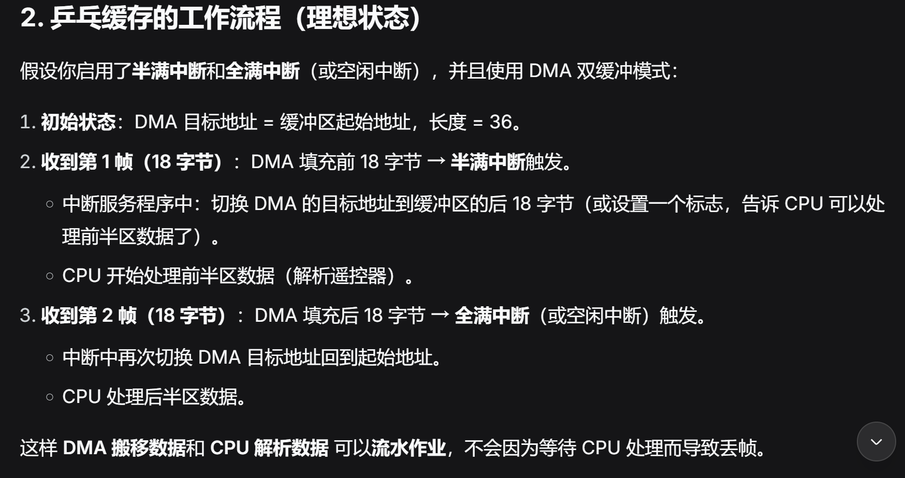

## booster的基本数据流（全向）
### 一、初始化
#### INIT 的核心就是“通信接口”和“设备对象”的初始化。
##### 通信初始化以UART为例：
```c
/**
 * @brief 初始化UART
 *
 * @param huart UART编号
 * @param Callback_Function 处理回调函数
 */
void UART_Init(UART_HandleTypeDef *huart, UART_Call_Back Callback_Function, uint16_t Rx_Buffer_Length)
{
    if (huart->Instance == USART1)
    {
        UART1_Manage_Object.UART_Handler = huart;
        UART1_Manage_Object.Callback_Function = Callback_Function;
        UART1_Manage_Object.Rx_Buffer_Length = Rx_Buffer_Length;
        HAL_UARTEx_ReceiveToIdle_DMA(huart, UART1_Manage_Object.Rx_Buffer, UART1_Manage_Object.Rx_Buffer_Length);
        __HAL_DMA_DISABLE_IT(&hdma_usart1_rx, DMA_IT_HT);
        memset(UART1_Manage_Object.Rx_Buffer,0,UART1_Manage_Object.Rx_Buffer_Length);
    }
    else if (huart->Instance == UART5)
    {
        UART5_Manage_Object.UART_Handler = huart;
        UART5_Manage_Object.Callback_Function = Callback_Function;
        UART5_Manage_Object.Rx_Buffer_Length = Rx_Buffer_Length;
        HAL_UARTEx_ReceiveToIdle_DMA(huart, UART5_Manage_Object.Rx_Buffer, UART5_Manage_Object.Rx_Buffer_Length*2);
    }
    else if (huart->Instance == UART7)
    {
        UART7_Manage_Object.UART_Handler = huart;
        UART7_Manage_Object.Callback_Function = Callback_Function;
        UART7_Manage_Object.Rx_Buffer_Length = Rx_Buffer_Length;
        HAL_UARTEx_ReceiveToIdle_DMA(huart, UART7_Manage_Object.Rx_Buffer, UART7_Manage_Object.Rx_Buffer_Length);
    }
    else if (huart->Instance == UART8)
    {
        UART8_Manage_Object.UART_Handler = huart;
        UART8_Manage_Object.Callback_Function = Callback_Function;
        UART8_Manage_Object.Rx_Buffer_Length = Rx_Buffer_Length;
        HAL_UARTEx_ReceiveToIdle_DMA(huart, UART8_Manage_Object.Rx_Buffer, UART8_Manage_Object.Rx_Buffer_Length);
    }
    else if (huart->Instance == UART9)
    {
        UART9_Manage_Object.UART_Handler = huart;
        UART9_Manage_Object.Callback_Function = Callback_Function;
        UART9_Manage_Object.Rx_Buffer_Length = Rx_Buffer_Length;
        HAL_UARTEx_ReceiveToIdle_DMA(huart, UART9_Manage_Object.Rx_Buffer, UART9_Manage_Object.Rx_Buffer_Length);
    }
    else if (huart->Instance == USART10)
    {
        UART10_Manage_Object.UART_Handler = huart;
        UART10_Manage_Object.Callback_Function = Callback_Function;
        UART10_Manage_Object.Rx_Buffer_Length = Rx_Buffer_Length;
        HAL_UARTEx_ReceiveToIdle_DMA(huart, UART10_Manage_Object.Rx_Buffer, UART10_Manage_Object.Rx_Buffer_Length);
        __HAL_DMA_DISABLE_IT(&hdma_usart10_rx, DMA_IT_HT);
        memset(UART10_Manage_Object.Rx_Buffer,0,UART10_Manage_Object.Rx_Buffer_Length);
    }
    
}
```
##### 管理对象结构体
```c
struct Struct_UART_Manage_Object {
    UART_HandleTypeDef *UART_Handler;   // HAL 库 UART 句柄
    uint8_t Tx_Buffer[UART_BUFFER_SIZE];
    uint8_t Rx_Buffer[UART_BUFFER_SIZE];
    uint16_t Rx_Buffer_Length;          // 接收缓冲区大小（初始化时设定）
    uint16_t Tx_Buffer_Length;
    uint16_t Rx_Length;                 // 当前接收到的有效数据长度
    uint16_t Tx_Length;
    UART_Call_Back Callback_Function;   // 用户层回调函数指针
};//管理对象结构体
```

###### 代码中为每个可能的 UART 外设静态实例化了一个独立的管理对象.(一对一绑定【根据句柄】，容易拓展)
###### 虽然定义了 10 个对象，但实际是否“拥有”外设取决于是否调用了 UART_Init 对其进行初始化。未初始化的对象中 UART_Handler 为 NULL，不会被使用。
###### *每个 UART 拥有独立的管理对象，保存了该外设所有相关数据（句柄、缓冲区、回调）。*🥸🥸🥸


### 二、输入（先看DR16）
#### UART 驱动完整执行流程（时序顺序）
#### 1.🤨定义管理对象（全局静态分配）
```c
Struct_UART_Manage_Object UART1_Manage_Object = {0};
Struct_UART_Manage_Object UART2_Manage_Object = {0};
// ...
Struct_UART_Manage_Object UART10_Manage_Object = {0};
```
##### 每个外设一个对象，存储句柄、缓冲区、回调等。

##### 初始全零，后续 UART_Init 填充。
#### 2.🤨上层调用 UART_Init 初始化（在 Task_Init 中）
```c
UART_Init(&huart5, DR16_UART5_Callback, 18);//云台板初始化 DR16：
``` 
##### 通过句柄找到对应的管理对象（UART5_Manage_Object）。

##### 保存 UART_Handler、Callback_Function、Rx_Buffer_Length。

##### 调用 HAL_UARTEx_ReceiveToIdle_DMA 启动 DMA + 空闲中断接收。

##### 对于 UART5，实际 DMA 接收长度 = 18 * 2 = 36（可能用于乒乓缓冲？？？）。
###### 我觉得，这里暂时就是防止 DMA 接收溢出和配合半满中断（因为前面uart5的半满中断没有被禁用）

##### （部分外设）禁用 DMA *半满中断、清空接收缓冲区*。
###### 了解一下

#### 3.硬件接收数据触发中断（DMA + 空闲中断）
###### 当 UART 收到数据，DMA 自动将数据搬运到 Rx_Buffer。

###### 当总线空闲（一帧结束）或 DMA 接收满指定长度时，触发 空闲中断。

###### HAL 库调用 HAL_UARTEx_RxEventCallback，传入接收到的字节数 Size。
#### 4.中断回调 HAL_UARTEx_RxEventCallback 分发数据
###### 根据 huart->Instance 找到管理对象，例如 UART5：
```c
else if (huart->Instance == UART5) {
    UART5_Manage_Object.Rx_Length = Size;
    // 重新启动 DMA 接收（连续模式）
    HAL_UARTEx_ReceiveToIdle_DMA(huart, UART5_Manage_Object.Rx_Buffer, 
                                 UART5_Manage_Object.Rx_Buffer_Length * 2);//采用×2！！！
    // 检查长度合法性
    if (Size <= UART5_Manage_Object.Rx_Buffer_Length)
        UART5_Manage_Object.Callback_Function(UART5_Manage_Object.Rx_Buffer, Size);
    else
        memset(UART5_Manage_Object.Rx_Buffer, 0, ...);
}
```
##### 重新启动 DMA 很重要，否则只能接收一帧。

##### 调用用户注册的回调（如 DR16_UART5_Callback）。
#### 5.用户回调函数处理数据（例如 DR16_UART5_Callback）
###### tsk_config_and_callback.cpp中
```c
void DR16_UART5_Callback(uint8_t *Buffer, uint16_t Length)
{
    chariot.DR16.DR16_UART_RxCpltCallback(Buffer);
    //底盘 云台 发射机构 的控制策略
    chariot.TIM_Control_Callback();
}
```
##### 解析协议数据（如遥控器通道值）存入 DR16 对象。

##### 触发部分控制逻辑.
#### 6.发送数据（可选）
```c
uint8_t UART_Send_Data(UART_HandleTypeDef *huart, uint8_t *Data, uint16_t Length)
{
    return (HAL_UART_Transmit_DMA(huart, Data, Length));
}
```
### 接下来深入学习5.DR16_UART5_Callback
```c

/**
 * @brief UART通信接收回调函数
 *
 * @param Rx_Data 接收的数据
 */
void Class_DR16::DR16_UART_RxCpltCallback(uint8_t *Rx_Data)
{
    //滑动窗口, 判断遥控器是否在线
    DR16_Flag += 1;
    DR16_Data_Process();
    //保留上一次数据
    memcpy(&Pre_UART_Rx_Data, UART_Manage_Object_1->Rx_Buffer, sizeof(Struct_DR16_UART_Data));
}
```
### first.遥控器数据解析
#### 1.DR16_Flag主要是用于遥控器存活检测
#### 2. DR16_Data_Process();在这里只处理了摇杆和拨杆（鼠标键盘类似控制放在了Image_UART_RxCpltCallback(uint8_t *Rx_Data)中，日后再深究）
#### 3.保留上一次数据
### second.控制策略
```c
/**
 * @brief 控制回调函数
 *
 */
#ifdef GIMBAL
void Class_Chariot::TIM_Control_Callback()
{
    // 判断DR16控制数据来源
    Judge_DR16_Control_Type();
    Judge_VT13_Control_Type();
    // 底盘，云台，发射机构控制逻辑
    Control_Chassis();
    Control_Gimbal();
    Control_Booster();
}
#endif
```
## 三、 具体看Control_Booster();控制策略
```c
 // 右上 开启摩擦轮和发射机构
        if (DR16.Get_Right_Switch() == DR16_Switch_Status_UP)
        {Booster.Set_Booster_Control_Type(Booster_Control_Type_CEASEFIRE);
            Booster.Set_Friction_Control_Type(Friction_Control_Type_ENABLE);
            Fric_Status = Fric_Status_OPEN;
            //......
        }
```
##### dr16控制发射基本流程比较简单，暂时不涉及上下板通信。
```c
//对比M61代码，核心逻辑没有变，只是形式变了一点点，现有代码依旧能用，决定暂不更改
//最近考试任务比较重，暂时先写到这里
```